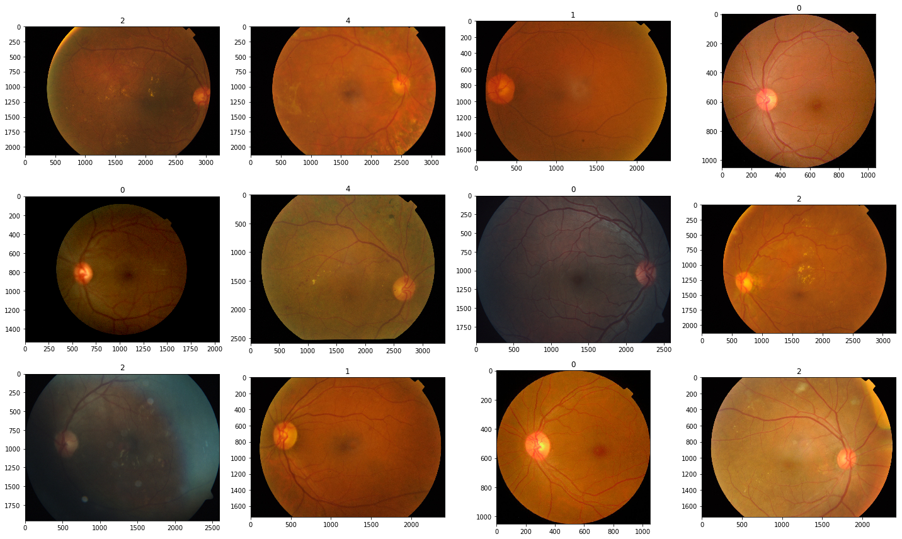

# Kaggle: APTOS 2019 Blindness Detection ([link](https://www.kaggle.com/c/aptos2019-blindness-detection))

Data: 3 362 retina images

Task: identify the severity of diabetic retinopathy on a scale of 0 to 4

Evaluation: quadratic weighted kappa

Solution: 2D-CNN with DenseNet121 base

Success: 0.858 QWP

